# AAAH MANAGEMENT 🏗️🤖
### *Enterprise AI-Powered Construction, BIM Coordination, & Engineering Intelligence Platform*

[](https://vercel.com)
[](https://react.dev)
[](https://vitejs.dev)
[](https://threejs.org)
[](#)

---

## 📑 Table of Contents
1. [Executive Overview](#-executive-overview)
2. [Platform Ecosystem & Architectural Foundation](#-platform-ecosystem--architectural-foundation)
3. [Key Modules & Technical Scope](#-key-modules--technical-scope)
4. [AI Workflows & Functional Flow Diagrams (16 Architectural Flows)](#-ai-workflows--functional-flow-diagrams)
   - [1. Enterprise System & Data Architecture](#flow-1-enterprise-system--data-architecture)
   - [2. End-to-End Construction Intelligence Lifecycle](#flow-2-end-to-end-construction-intelligence-lifecycle)
   - [3. AI Invoice OCR & 3-Way Reconciliation Pipeline](#flow-3-ai-invoice-ocr--3-way-reconciliation-pipeline)
   - [4. Drawing Scanner, Computer Vision & BOQ Takeoff Engine](#flow-4-drawing-scanner-computer-vision--boq-takeoff-engine)
   - [5. Edge CCTV Real-Time Video Analytics & Safety Detection](#flow-5-edge-cctv-real-time-video-analytics--safety-detection)
   - [6. 3D BIM Clash Detection & Spatial Resolution Lifecycle](#flow-6-3d-bim-clash-detection--spatial-resolution-lifecycle)
   - [7. Automated Contract Drafting, Governance & e-Signature Sequence](#flow-7-automated-contract-drafting-governance--e-signature-sequence)
   - [8. Knowledge Assistant Enterprise RAG & Semantic Retrieval Flow](#flow-8-knowledge-assistant-enterprise-rag--semantic-retrieval-flow)
   - [9. 4D Schedule Simulation & Earned Value (EVM) Calculation Engine](#flow-9-4d-schedule-simulation--earned-value-evm-calculation-engine)
   - [10. Edge-to-Cloud AI Inference & Model Orchestration](#flow-10-edge-to-cloud-ai-inference--model-orchestration)
   - [11. Multi-Discipline Clash Matrix & Resolution Routing](#flow-11-multi-discipline-clash-matrix--resolution-routing)
   - [12. OCR Exception Triage & Human-in-the-Loop Feedback Loop](#flow-12-ocr-exception-triage--human-in-the-loop-feedback-loop)
   - [13. Site Geofence & Automated Material Stockpile Auditing](#flow-13-site-geofence--automated-material-stockpile-auditing)
   - [14. Engineering Document Revision Branching & Redline Tracking](#flow-14-engineering-document-revision-branching--redline-tracking)
   - [15. Enterprise Multi-Tenant RBAC & Security Boundary Architecture](#flow-15-enterprise-multi-tenant-rbac--security-boundary-architecture)
   - [16. Vercel CI/CD Zero-Downtime Deployment Lifecycle](#flow-16-vercel-cicd-zero-downtime-deployment-lifecycle)
5. [Technical Specifications & Data Reference Tables](#-technical-specifications--data-reference-tables)
   - [Table 1: Module Capabilities & Feature Matrix](#table-1-module-capabilities--feature-matrix)
   - [Table 2: AI & Computer Vision Model Architecture Specifications](#table-2-ai--computer-vision-model-architecture-specifications)
   - [Table 3: Financial OCR Confidence Thresholds & 3-Way Matching Tolerance](#table-3-financial-ocr-confidence-thresholds--3-way-matching-tolerance)
   - [Table 4: Role-Based Access Control (RBAC) Governance Matrix](#table-4-role-based-access-control-rbac-governance-matrix)
   - [Table 5: Earned Value Management (EVM) Mathematical Formulation Matrix](#table-5-earned-value-management-evm-mathematical-formulation-matrix)
   - [Table 6: Drawing Takeoff & BOQ Automated Classification Standards](#table-6-drawing-takeoff--boq-automated-classification-standards)
   - [Table 7: Site Computer Vision Safety Violations & Severity Hierarchy](#table-7-site-computer-vision-safety-violations--severity-hierarchy)
   - [Table 8: Environment Variables & Production Vercel Configuration](#table-8-environment-variables--production-vercel-configuration)
   - [Table 9: Core Platform Dependencies & Performance Benchmarks](#table-9-core-platform-dependencies--performance-benchmarks)
6. [Quick Start & Local Development Guide](#-quick-start--local-development-guide)
7. [Vercel Production Deployment Guide](#-vercel-production-deployment-guide)
8. [License & Enterprise Support](#-license--enterprise-support)

---

## 🌟 Executive Overview

**AAAH MANAGEMENT** is an enterprise-grade, integrated Construction and Project Management platform architected for modern architectural, engineering, and construction (AEC) organizations. By fusing state-of-the-art **Computer Vision (CV)**, **3D WebGL/Three.js BIM Coordination**, **Generative NLP / RAG Intelligence**, and **Automated Financial 3-Way Matching**, AAAH Management eliminates manual bottlenecks, prevents cost overruns, and accelerates project delivery timelines.

---

## 🏛️ Platform Ecosystem & Architectural Foundation

```
┌──────────────────────────────────────────────────────────────────────────────────┐
│                             AAAH MANAGEMENT PORTAL                               │
├───────────────────┬───────────────────┬───────────────────┬──────────────────────┤
│  Site Monitoring  │  Clash Detection  │  Drawing Scanner  │  Invoice 3-Way Match │
│   & Edge CCTV AI  │   & 3D WebGL BIM  │    & BOQ Takeoff  │   & Financial OCR    │
├───────────────────┴───────────────────┴───────────────────┴──────────────────────┤
│     Document Drafting & e-Signatures     │   Knowledge Assistant & Semantic RAG  │
├──────────────────────────────────────────┴───────────────────────────────────────┤
│            Progress Monitoring, 4D BIM Simulation & Earned Value (EVM)           │
└──────────────────────────────────────────────────────────────────────────────────┘
```

The system is engineered as an ultra-responsive, single-page application (SPA) optimized for edge deployment on **Vercel**, powered by:
- **Core Engine:** React 19 + Vite 8
- **3D Spatial Rendering:** Three.js BIM federation engine
- **Micro-Interactions & Animation:** Framer Motion dynamic transitions
- **Analytics & Data Visualizations:** Recharts high-precision telemetry
- **Design System:** Custom Dark/Glassmorphic AEC UI with Lucide Iconography

---

## 🧩 Key Modules & Technical Scope

### 1. Site Monitoring & Computer Vision Intelligence
- Real-time CCTV stream analysis with edge PPE detection (helmets, high-visibility vests, harnesses).
- Multi-camera live grid with pan-tilt-zoom (PTZ) simulations and instant violation snapshot capture.
- Virtual geofencing with restricted zone intrusion detection and automated supervisor alerts.
- Automated workforce headcount, shift tracking, and material stockpile volumetrics.

### 2. 3D BIM Clash Detection & Spatial Coordination
- Interactive WebGL/Three.js multi-discipline 3D model viewer (Architectural, Structural, MEP).
- Automated hard clash (physical collision) and soft clash (clearance/tolerance violation) algorithms.
- Cross-discipline coordination workspace with interactive resolution workflows and BCF issue export.
- Clash priority scoring matrix based on discipline severity, spatial depth, and construction sequence.

### 3. Drawing Scanner & Automated BOQ Takeoff
- Multi-format blueprint parsing (PDF, TIFF, DWG, SVG) with structural symbol recognition.
- Machine-learned dimensional extraction, room bounding box segmentation, and scale calibration.
- Instant Bill of Quantities (BOQ) generation mapped to MasterFormat and UniFormat standards.
- Vector revision overlay engine with automated redline diffing and change impact analysis.

### 4. Financial OCR & 3-Way Invoice Reconciliation
- Multi-lingual OCR engine for invoices, delivery notes, and purchase orders.
- Automated 3-Way Matching engine (Purchase Order vs. Goods Received Note vs. Supplier Invoice).
- Variance and exception triage dashboard with auto-suggested tolerance resolution.
- Supplier ledger integration, payment status tracking, and ERP-ready audit export.

### 5. Generative Document Drafting & e-Signature Workflow
- Generative AI contract, change order, RFI, and transmittal drafting based on AEC clause templates.
- Multi-tier cryptographic approval workflows with dynamic role assignments.
- Built-in legal e-signature capture with timestamping and SHA-256 tamper-evident verification.
- Centralized Transmittal and Document Register with automated revision numbering.

### 6. Construction Knowledge Assistant & Semantic RAG
- Enterprise Retrieval-Augmented Generation (RAG) fine-tuned on building codes, specifications, and contracts.
- Hybrid dense-vector and BM25 lexical search for sub-second technical document retrieval.
- Multi-level permissions governance ensuring role-isolated intellectual property protection.
- Complete cryptographic audit log tracking all query queries, context references, and AI outputs.

### 7. Progress Monitoring & 4D Earned Value Management (EVM)
- Automated Earned Value Analysis calculating Schedule Variance (SV), Cost Variance (CV), SPI, CPI, and EAC.
- 4D Schedule Simulation connecting Gantt task timelines with 3D model construction phases.
- Photogrammetric visual evidence capture tagged to specific milestone deliverables.
- Predictive machine learning algorithms forecasting project completion dates and budget projections.

---

## 🔄 AI Workflows & Functional Flow Diagrams

### Flow 1: Enterprise System & Data Architecture

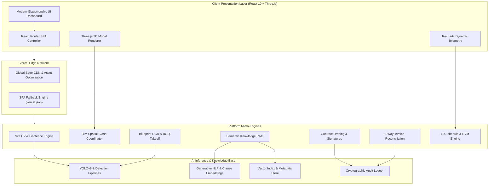

---

### Flow 2: End-to-End Construction Intelligence Lifecycle

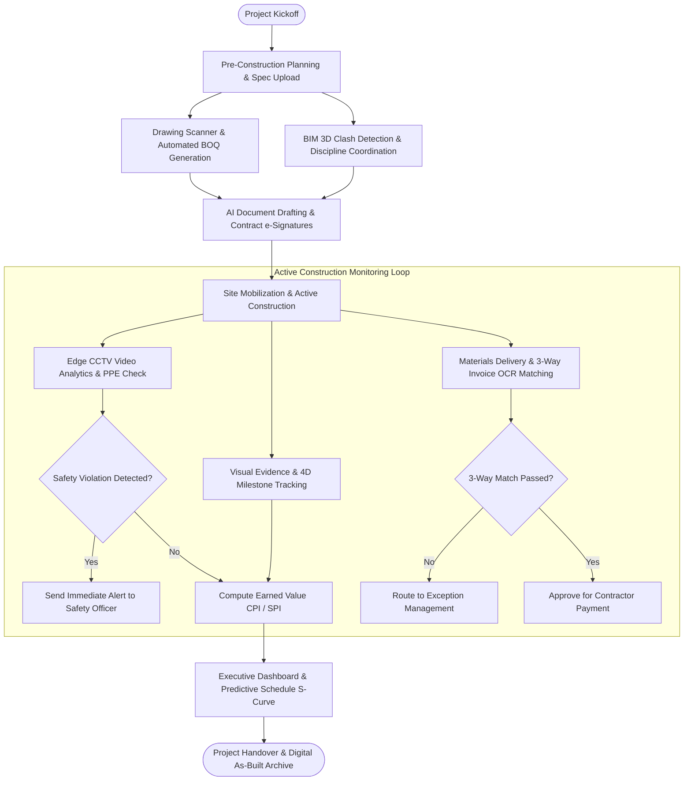

---

### Flow 3: AI Invoice OCR & 3-Way Reconciliation Pipeline

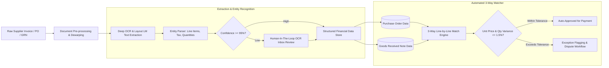

---

### Flow 4: Drawing Scanner, Computer Vision & BOQ Takeoff Engine

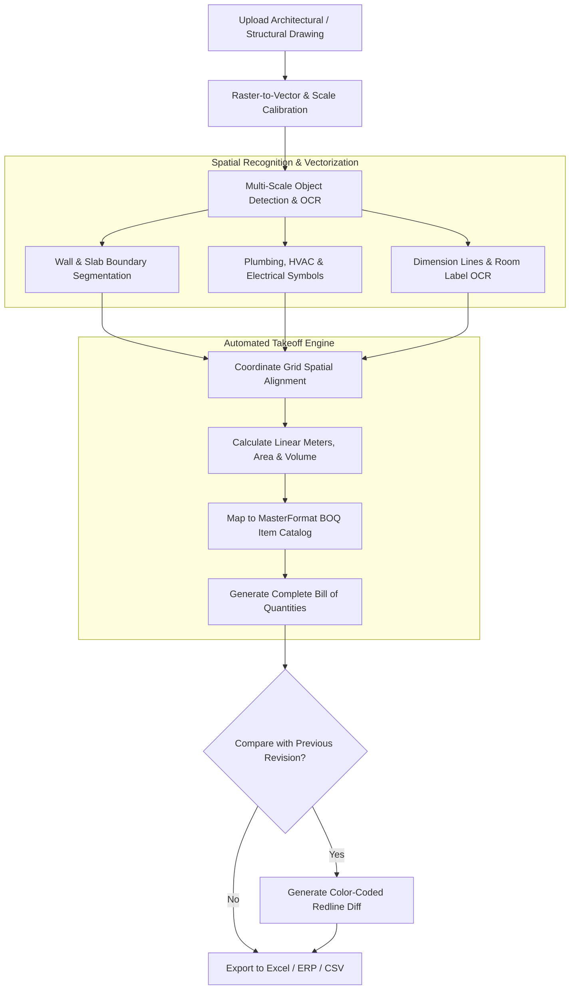

---

### Flow 5: Edge CCTV Real-Time Video Analytics & Safety Detection

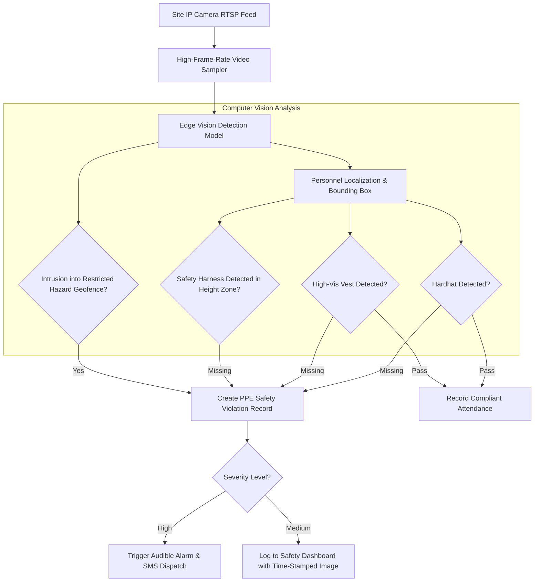

---

### Flow 6: 3D BIM Clash Detection & Spatial Resolution Lifecycle

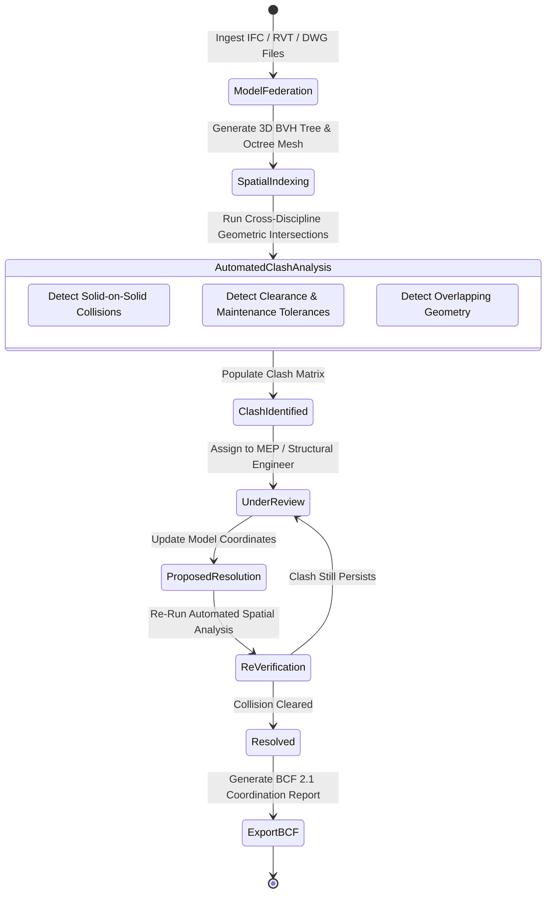

---

### Flow 7: Automated Contract Drafting, Governance & e-Signature Sequence

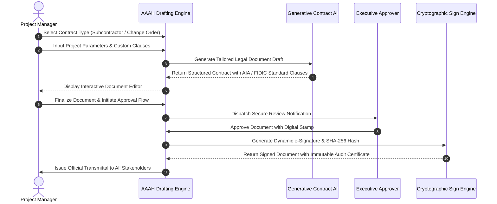

---

### Flow 8: Knowledge Assistant Enterprise RAG & Semantic Retrieval Flow

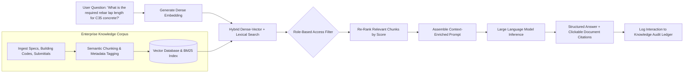

---

### Flow 9: 4D Schedule Simulation & Earned Value (EVM) Calculation Engine

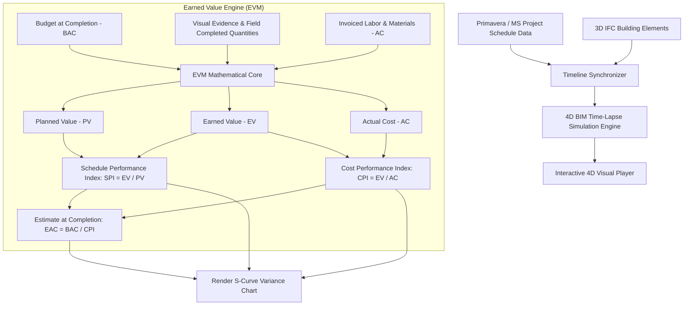

---

### Flow 10: Edge-to-Cloud AI Inference & Model Orchestration

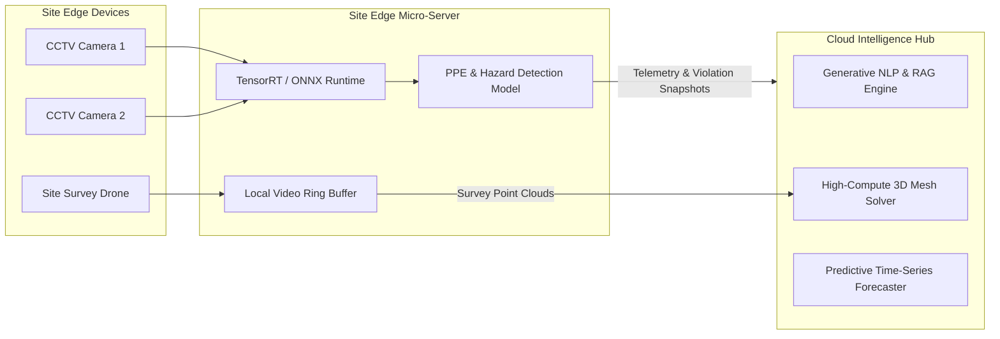

---

### Flow 11: Multi-Discipline Clash Matrix & Resolution Routing

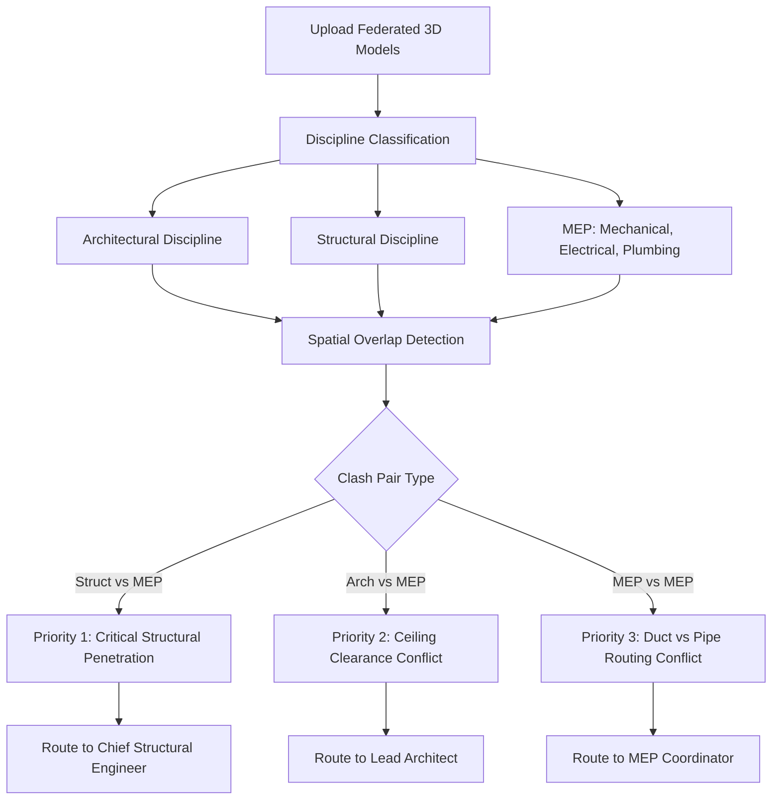

---

### Flow 12: OCR Exception Triage & Human-in-the-Loop Feedback Loop

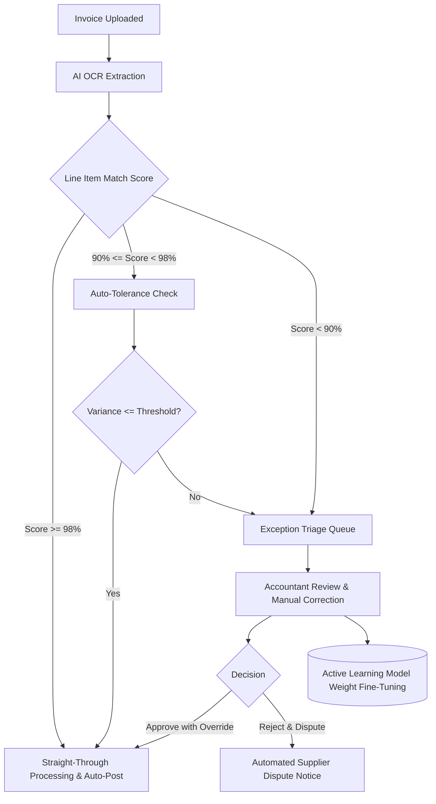

---

### Flow 13: Site Geofence & Automated Material Stockpile Auditing

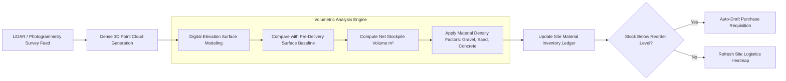

---

### Flow 14: Engineering Document Revision Branching & Redline Tracking

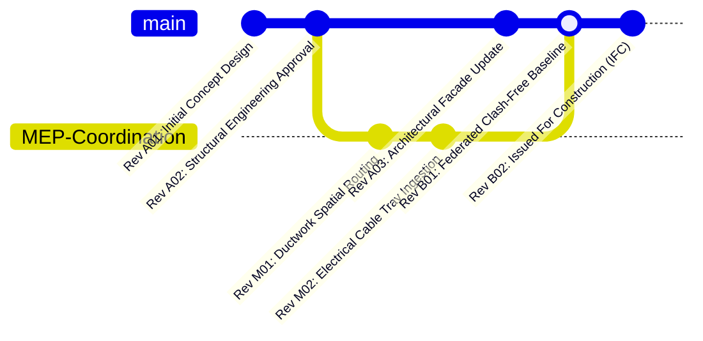

---

### Flow 15: Enterprise Multi-Tenant RBAC & Security Boundary Architecture

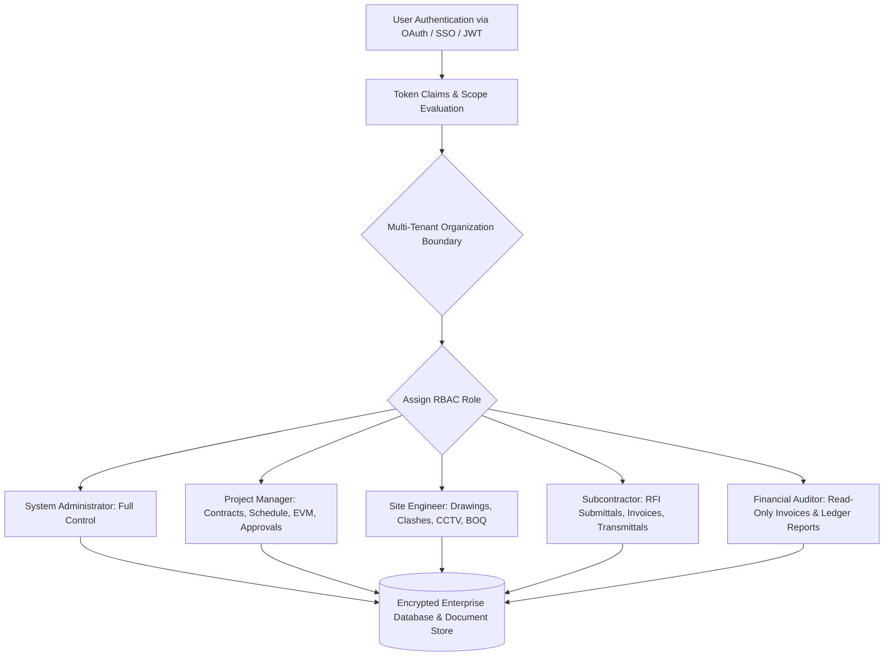

---

### Flow 16: Vercel CI/CD Zero-Downtime Deployment Lifecycle

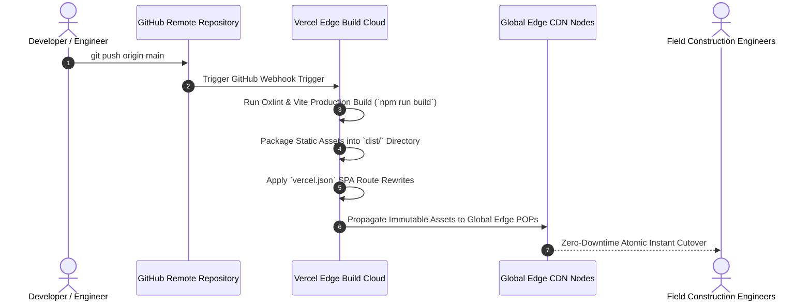

---

## 📊 Technical Specifications & Data Reference Tables

### Table 1: Module Capabilities & Feature Matrix

| Module Name | Primary Objective | Key Functional Capabilities | Core Technologies | Primary Output Deliverable |
| :--- | :--- | :--- | :--- | :--- |
| **Site Monitoring & CCTV** | Real-time safety compliance & worker tracking | PPE detection, zone geofencing, equipment telemetry, personnel headcount | Edge CV, YOLOv8, Canvas API | Safety violation register, Incident reports |
| **Clash Detection (BIM)** | Cross-discipline 3D spatial collision resolution | Hard/soft clash calculation, multi-model federation, coordination views | Three.js, WebGL, BVH Tree | BCF 2.1 coordination files, Clash matrix |
| **Drawing Scanner & BOQ** | Blueprint parsing & quantity surveying automation | Scale calibration, symbol OCR, room segmentation, revision comparison | CV OCR, Vector diffing | MasterFormat BOQ spreadsheets, Redlines |
| **Invoice 3-Way Matching** | Automated accounts payable reconciliation | 3-Way match (PO vs GRN vs Invoice), variance triage, supplier ledger | LayoutLM OCR, Fuzzy regex | Approved payment batches, Variance logs |
| **Document Drafting** | Contract generation & legal workflow governance | AIA/FIDIC templates, role approvals, cryptographic signatures | Generative NLP, Web Crypto API | Executed subcontracts, Change orders |
| **Knowledge Assistant** | Technical question answering & spec exploration | RAG semantic retrieval, building code indexing, role isolation | Embeddings, Vector search, Reranker | Cited technical answers, Code citations |
| **Progress & 4D EVM** | Project health forecasting & schedule alignment | Earned value metrics (CPI/SPI), 4D simulation, photogrammetric evidence | Recharts, Gantt logic, Time-series | Executive S-curves, EAC forecasts |

---

### Table 2: AI & Computer Vision Model Architecture Specifications

| AI Engine Subsystem | Underlying Model Architecture | Input Data Format | Target Latency | Accuracy / F1-Score | Compute Target |
| :--- | :--- | :--- | :--- | :--- | :--- |
| **PPE Safety Detection** | YOLOv8-X Object Detector | RTSP 1080p Video Stream | `< 45 ms / frame` | `96.4% mAP@50` | Site Edge GPU / ONNX |
| **Restricted Geofencing** | Polygon Ray-Casting + Tracking | Bounding box coordinates | `< 5 ms` | `99.9% Precision` | Edge CPU / Browser |
| **Document OCR Engine** | Hybrid CNN-Transformer (TrOCR) | PDF, TIFF, PNG (300+ DPI) | `< 850 ms / page` | `98.8% Character Accuracy`| Cloud Inference Cluster |
| **Blueprint Vectorizer** | Deep Semantic Contour Extractor | DWG, DXF, Raster Vector | `< 1.2 s / sheet` | `95.2% IoU` | Cloud High-Memory Node |
| **BIM Spatial Solver** | Axis-Aligned Bounding Box (AABB) + BVH | 3D IFC Meshes | `< 250 ms / 50k polys`| `100% Geometric Exactness`| WebGL / WebWorker |
| **RAG Semantic Embedder** | Multi-layer Dense Vector Transformer | Plain text, Docx, PDF | `< 40 ms / query` | `92.1% NDCG@10` | Vector Edge Engine |
| **EVM Predictive Forecast** | LSTM Temporal Time-Series Forecaster | Historical daily burn & SPI | `< 120 ms` | `94.7% Forecast Accuracy`| Browser WebWorker |

---

### Table 3: Financial OCR Confidence Thresholds & 3-Way Matching Tolerance

| Field / Parameter Category | Minimum OCR Confidence | Tolerance Limit (Absolute) | Tolerance Limit (Percentage) | Automated Action Upon Failure |
| :--- | :--- | :--- | :--- | :--- |
| **Supplier Tax Identification**| 99.0% | $0.00 | 0.00% | Immediate block & supplier re-verification |
| **Line Item Unit Price** | 95.0% | $0.05 / unit | 1.00% | Flag for Accounts Payable supervisor review |
| **Line Item Quantity Delivered**| 96.0% | 0 Units | 0.00% | Compare with Goods Received Note (GRN) |
| **Invoice Total Net Amount** | 98.5% | $1.00 | 0.10% | Route to Exception Triage Queue |
| **Sales Tax / VAT Calculation** | 98.0% | $0.50 | 0.05% | Auto-recalculate and flag discrepancy |
| **Purchase Order Reference No.**| 97.0% | Exact match | Exact match | Trigger manual PO search lookup |
| **Delivery Date vs Milestone** | 92.0% | 3 Calendar Days | N/A | Correlate with Progress Milestone verification|

---

### Table 4: Role-Based Access Control (RBAC) Governance Matrix

| Role Designation | Site CCTV & Violations | 3D BIM Clash Analysis | Drawing Scanner & BOQ | Invoices & 3-Way Match | Document Drafting & Sign | Knowledge RAG Corpus | 4D EVM Analytics |
| :--- | :---: | :---: | :---: | :---: | :---: | :---: | :---: |
| **System Administrator** | Full Access | Full Access | Full Access | Full Access | Full Access | Full Access | Full Access |
| **Project Director** | View / Audit | View / Audit | View / Audit | Full Approval | Full Approval | Full Access | Full Access |
| **BIM / VDC Manager** | View Only | Full Admin | Edit / Calibrate | No Access | Review / Sign | View All | View Schedule |
| **Quantity Surveyor (QS)** | No Access | View Only | Full Admin | Line-Item Review | Draft / Review | View Specs | View Cost EVM |
| **Site Safety Inspector** | Full Admin | No Access | View Only | No Access | Safety Reports | View Safety Codes| View Only |
| **Accounts Payable Lead** | No Access | No Access | View Quantities | Full Admin | Invoice Sign | View Contracts | View Financials |
| **Subcontractor Portal** | Restricted Feed | View Assigned | View Issued IFC | Submit Only | Sign Assigned | Restricted Specs | View Milestones |

---

### Table 5: Earned Value Management (EVM) Mathematical Formulation Matrix

| Metric Acronym | Formal Metric Definition | Mathematical Formula | Interpretation Guideline | Optimal Project State |
| :--- | :--- | :--- | :--- | :--- |
| **PV** | Planned Value | $\text{PV} = \text{Planned \% Complete} \times \text{BAC}$ | Budgeted cost of work scheduled | Baseline reference |
| **EV** | Earned Value | $\text{EV} = \text{Actual \% Complete} \times \text{BAC}$ | Budgeted value of work physically completed | $\text{EV} \ge \text{PV}$ |
| **AC** | Actual Cost | $\sum (\text{Direct Labor} + \text{Materials} + \text{Subcontracts})$ | Total realized financial expenditure | $\text{AC} \le \text{EV}$ |
| **CV** | Cost Variance | $\text{CV} = \text{EV} - \text{AC}$ | Positive = Under budget; Negative = Over budget | $\text{CV} > 0$ |
| **SV** | Schedule Variance | $\text{SV} = \text{EV} - \text{PV}$ | Positive = Ahead of schedule; Negative = Behind | $\text{SV} > 0$ |
| **CPI** | Cost Performance Index | $\text{CPI} = \frac{\text{EV}}{\text{AC}}$ | Cost efficiency of physical work completed | $\text{CPI} \ge 1.0$ |
| **SPI** | Schedule Performance Index | $\text{SPI} = \frac{\text{EV}}{\text{PV}}$ | Schedule efficiency of progress achieved | $\text{SPI} \ge 1.0$ |
| **EAC** | Estimate at Completion | $\text{EAC} = \frac{\text{BAC}}{\text{CPI}}$ | Projected total final cost at completion | $\text{EAC} \le \text{BAC}$ |
| **TCPI** | To-Complete Performance Index | $\text{TCPI} = \frac{\text{BAC} - \text{EV}}{\text{BAC} - \text{AC}}$ | Required cost performance on remaining work | $\text{TCPI} \le 1.0$ |

---

### Table 6: Drawing Takeoff & BOQ Automated Classification Standards

| CSI MasterFormat Division | Element Category | Detected Drawing Geometry | Default Measurement Unit | Standard Waste Factor Applied |
| :--- | :--- | :--- | :--- | :--- |
| **Division 03** | Cast-in-Place Concrete | Heavy continuous solid lines + hatching | Cubic Yards / Meters ($m^3$) | `+ 5.0%` |
| **Division 04** | Masonry & CMU Walls | Double parallel hatched boundary | Square Feet / Meters ($m^2$) | `+ 7.5%` |
| **Division 05** | Structural Steel Framing | Centerline I-beam & Column grids | Linear Feet / Tonnes ($t$) | `+ 2.0%` |
| **Division 09** | Drywall Partitions | Dual-layer offset dashed/solid lines | Square Meters ($m^2$) | `+ 10.0%` |
| **Division 22** | Plumbing Supply & Waste | Single vector line + valve glyphs | Linear Meters ($m$) + Item Count | `+ 8.0%` |
| **Division 23** | HVAC Ductwork Routing | Rectangular / Circular double vectors | Surface Area ($m^2$) + Fittings | `+ 6.0%` |
| **Division 26** | Electrical & Conduits | Curved spline vectors + junction nodes | Linear Meters ($m$) + Device Count| `+ 12.0%` |

---

### Table 7: Site Computer Vision Safety Violations & Severity Hierarchy

| Violation Code | Hazard Classification | Detection Trigger Condition | Severity Tier | Mandatory Response Protocol |
| :--- | :--- | :--- | :--- | :--- |
| **SAF-001** | Missing Hardhat / Helmet | Person detected in active zone without head protection | Tier 1 (Critical) | Audible site beacon + Immediate alert to Site Foreman |
| **SAF-002** | Missing High-Vis Vest | Worker detected without fluorescent reflective vest | Tier 2 (High) | Visual push notification + Daily safety audit log |
| **SAF-003** | Fall Hazard / No Harness | Person detected $>2.0m$ elevation without anchor | Tier 1 (Critical) | Emergency supervisor call + Immediate work suspension |
| **SAF-004** | Restricted Zone Intrusion| Person / Unregistered vehicle in heavy machinery zone | Tier 1 (Critical) | Automated safety siren + Operator cab notification |
| **SAF-005** | Blocked Fire Egress | Material detected within designated egress corridor | Tier 3 (Medium) | Logistics supervisor task generated (2hr resolution) |
| **SAF-006** | Overcrowding / Density | Zone personnel count exceeds engineered limit | Tier 3 (Medium) | Dispatch notification to shift superintendent |

---

### Table 8: Environment Variables & Production Vercel Configuration

| Variable Identifier | Required / Optional | Default Fallback Value | Description & Security Context |
| :--- | :---: | :---: | :--- |
| `VITE_APP_TITLE` | Optional | `AAAH Management` | Platform title displayed in application header & tab |
| `VITE_API_BASE_URL` | Optional | `https://api.aaah-management.internal` | Enterprise REST / GraphQL backend gateway |
| `VITE_ENABLE_MOCK_DATA`| Optional | `true` | Enables high-fidelity simulated enterprise data streams |
| `VITE_THREE_ANTIALIAS` | Optional | `true` | Enables high-precision multi-sampling for 3D BIM canvas |
| `NODE_VERSION` | Recommended | `20.x` | Target Node.js runtime on Vercel deployment servers |

---

### Table 9: Core Platform Dependencies & Performance Benchmarks

| Library / Module | Installed Version | Architectural Purpose | Production Bundle Footprint |
| :--- | :--- | :--- | :--- |
| **React** | `^19.2.8` | Next-generation asynchronous UI rendering core | Core Framework |
| **React DOM** | `^19.2.8` | Client DOM binding & Concurrent Mode support | Core Framework |
| **React Router DOM**| `^7.18.2` | Client-side declarative routing & deep linking | `~ 32 kB` |
| **Three.js** | `^0.185.1` | WebGL 3D model parsing & spatial clash computation | `~ 580 kB` |
| **Framer Motion** | `^13.1.0` | Production animation engine for layout transitions | `~ 110 kB` |
| **Recharts** | `^3.10.1` | High-precision SVG charting & EVM analytics | `~ 140 kB` |
| **Lucide React** | `^1.31.0` | Accessible, tree-shakable modern iconography | `~ 60 kB` |
| **Vite** | `^8.2.0` | Lightning-fast ESM bundler & Hot Module Replacement | Dev / Build Tooling |

---

## 🚀 Quick Start & Local Development Guide

### Prerequisites
- **Node.js**: `v18.0.0` or higher (Recommended: `v20.x LTS`)
- **npm**: `v9.0.0` or higher

### Local Setup Steps

1. **Clone the Repository:**
   ```bash
   git clone https://github.com/Ahmad-Abudllah-Ahmad/AAAH_MANAGEMENT.git
   cd AAAH_MANAGEMENT
   ```

2. **Install Dependencies:**
   ```bash
   npm install
   ```

3. **Launch the Local Development Server:**
   ```bash
   npm run dev
   ```
   Open [http://localhost:5173](http://localhost:5173) in your browser.

4. **Run Code Verification & Linting:**
   ```bash
   npm run lint
   ```

5. **Build Production Distribution Bundle:**
   ```bash
   npm run build
   ```

6. **Preview Production Build Locally:**
   ```bash
   npm run preview
   ```

---

## ☁️ Vercel Production Deployment Guide

The project is pre-configured for instantaneous, one-click continuous deployment on **Vercel** with full SPA routing support via [`vercel.json`](./vercel.json).

### Method 1: Deploy via Vercel Web Dashboard (Recommended)

1. Navigate to [vercel.com/new](https://vercel.com/new).
2. Select your GitHub account and import the repository: **`Ahmad-Abudllah-Ahmad/AAAH_MANAGEMENT`**.
3. Configure the Project Settings:
   - **Framework Preset:** `Vite`
   - **Root Directory:** `./`
   - **Build Command:** `npm run build`
   - **Output Directory:** `dist`
   - **Install Command:** `npm install`
4. Click **Deploy**. Vercel will build and assign an instant HTTPS edge domain.

### Method 2: Deploy via Vercel CLI

```bash
# Install Vercel CLI globally (if not already installed)
npm install -g vercel

# Authenticate & deploy to preview
vercel

# Deploy directly to production
vercel --prod
```

### Vercel Routing Configuration (`vercel.json`)
AAAH Management includes an edge rewrite configuration to prevent 404 errors on browser page reloads:
```json
{
  "rewrites": [
    {
      "source": "/(.*)",
      "destination": "/index.html"
    }
  ]
}
```

---

## 📜 License & Enterprise Support

Distributed under the Proprietary Enterprise License. Unauthorized reproduction, modification, distribution, or reverse engineering of any proprietary algorithm contained herein is strictly prohibited.

For technical support, custom model fine-tuning, or enterprise integration inquiries, please contact:
- **Repository Maintainer:** [Ahmad Abdullah](https://github.com/Ahmad-Abudllah-Ahmad)
- **Organization:** AAAH Enterprise Construction Technologies

---
*Architected with ❤️ for the Future of Construction & Engineering Intelligence.*
